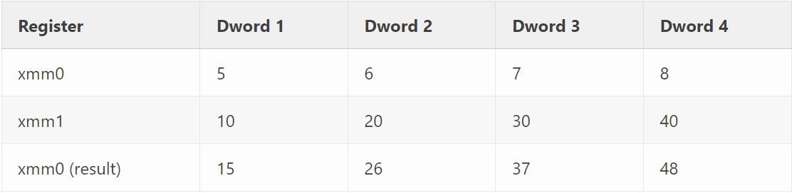

# Introduction

## The Ultimate Goal&#x20;

* Take standard applications and JIT them to their AVX-512 equivalent, such that we can fuzz 16 VMs at a time per thread.
* The net result of this work allows for high-performance fuzzing (\~ 40 billion to 120 billion instructions per second), depending on the target.
* While gathering differential coverage on code, register, and memory state.
* By gathering more than just code coverage, we can track the state of code deeper than just code coverage itself&#x20;

## Definitions&#x20;

### Notes for me

* MIPS Emulator development&#x20;
* JIT internals&#x20;

## Short Intro to Snapshot Fuzzing&#x20;

Snapshot fuzzing is a method of fuzzing where you start from a partially executed system state.&#x20;

If you had prior experience with user-mode fuzzing, you would say, "Why can't you just kill the process and rerun it?". What if you are fuzzing the kernel and OS? You will have encountered BSOD (Blue Screen Of Death), causing the system to crash. So we have a snapshot. A snapshot is basically when you dump memory and register the state to a core dump. Having a full memory and register state is the beginning of fuzzing. You can dump to any emulator, set up memory contents and permissions, set up register state, and continue execution. (minidump on Windows). Usually, when you are going for paper and research, you would have to automate and prove that your fuzzer was faster than some other fuzzer and how exotic it is. &#x20;

Having a memory state and register state means that we can inject and modify file contents in memory and continue execution with new input.&#x20;

Depending on the target, this can be difficult. But usually, you can make some custom rigging using, `strace` which is a debugging tool that can be used to discover the system resources in use by a workload. If your target is Windows, you can try using Logger/LogViewer, which is implemented in [Debugging Tools for Windows](https://learn.microsoft.com/en-us/windows-hardware/drivers/debugger/), DTrace, and Process Monitor to check FDs (File Descriptors).&#x20;

Time is significant when you are fuzzing, and so is the bug you find.

## Short Intro to Vectorized Instruction Sets&#x20;

Since these vectorized instruction sets are very hard to explain in one place, I will save up on the Assembly section of the note.

SIMD stands for Single Instruction Multiple Data. This means that a single instruction operates on multiple different pieces of data. SIMD instruction sets fall under names like MMX, SSE, AVX, AVX512 for x86, NEON for ARM, and AltiVec for PPC.&#x20;

SSE provides 128-bit SIMD operations for x86. SSE introduced sixteen 128-bit registers named `xmm0` through `xmm15` (only 8 `xmm` registers on 32-bit x86). These 128-bit registers can be treated as groups of different-sized, smaller pieces of data that sum up to 128 bits.&#x20;

* 4 single precision floats
* 2 double precision floats &#x20;
* 2 64-bit integers: &#x20;
* 4 32-bit integers&#x20;
* 8 16-bit integers&#x20;
* 16 8-bit integers

The bullet points above mean how many instructions can be inside a single 128-bit XMM register. &#x20;

This also shows how efficient the processing of various data types is in parallel.&#x20;

## Examples&#x20;

Gamozo used `PADDD` as an example.

`PADDD`&#x20;

Pack ADD Dwords, meaning that it performs parallel addition operations on the Dwords 1 to 5.&#x20;

`paddd xmm0 , xmm1`

<figure><figcaption><p>Gamozolabs - paddd xmm0, xmm1</p></figcaption></figure>

Duh, it means (5 + 10) (6 + 20) (7 + 30) (8 + 40) for xmm0 result.&#x20;

Starting with AVX, these registers were expanded to 256 bits. Allowing twice the throughput per instruction. Named `ymm0` and `ymm15`. AVX also introduced operand-form instructions, which allow storing a result in a different register than the ones being used in the operations.

## Second Example&#x20;

If there is a suffix of `{z}` on the kmask register selection&#x20;

Meaning that the operation is performed with zeroing rather than merging. If the corresponding bit in `k1` is zero, then the resultant lane is zeroed out rather than left unchanged. This gets rid of a dependency on the previous register state of the result and thus is faster, however it might not be suitable for all applications.&#x20;

`k0` mask is implicit and does not need to be specified. The `k0` register is hardwired to having all bits set, thus the operation is performed on all lanes unconditionally.&#x20;

Prior to AVX-512, compare instructions in SIMD typically yielded all ones in a given lane if the comparison was true, or all zeroes if it was false. In AVX-512, comparison instructions are done using kmasks&#x20;

So if we have&#x20;

`vpcmpgtd k2 {k1}, zmm10, zmm11`

`vpcmpgtd` V Packed CoMPare Greater Than Double word integers. What is V?  V is a prefix that the instruction is using AVX technology. So we can think that the above example is comparison of the double-precision floating-point values in the ZMM registers, 16 dwords in `zmm10` with the 16 dwords in `zmm11`, and only performs the compare on lanes enabled by `k1`, and stores the result of the compare into `k2` the result will be zero. Meaning the only set bits in `k2` will be from enabled lanes which were greater in `zmm10` than in `zmm11`

## Vectorized Emulation&#x20;

Since with snapshot fuzzing we start executing the same code, we are doing the same operations. This means we can convert the x86 instructions to their vectorized counterparts and run 16 VMs at a time rather than just one.&#x20;

### Proof of Concept&#x20;

```nasm
; Store value 5 in eax register
mov eax, 5 
; Store value 10 in ebx register
mov ebx, 10 
; Adds the values in the eax and ebx registers.
; Stores the result back in eax. 
add eax, ebx
; Subtracts 20 from teh value in the eax register.
; Stores the result back in eax. 
sub eax, 20 
```

### Proof of Concept (Vectorized)&#x20;

```nasm
; Register allocaiton:
; eax = zmm0 
; ebx = zmm1 

vpbroadcastd zmm0, dword ptr [memory containing constant 5] 
vpbroadcastd zmm1, dword ptr [memory containing constant 10] 
vpaddd       zmm0, zmm0, zmm1 
vpsubd       zmm0, zmm0, dword ptr [memory containing constant 20] {1to16}
```

### Future-building Xeon Phi stuff&#x20;

* [Intel Xeon PHI 7210 ](https://www.ebay.com/itm/364207471622?chn=ps\&mkevt=1\&mkcid=28\&srsltid=AfmBOopFKo4hYKKt0i5VUNthjfXnvJVwBT3tqu0ybmCYRW7ifbC2czNY4HY\&autorefresh=true)
* [Intel Node s7200AP Motherboard ](https://www.ebay.com/itm/175459054222?chn=ps\&mkevt=1\&mkcid=28\&srsltid=AfmBOoohJXByD2O\_T4sNN\_D3dslds1MmITaKuzZw8q4M3CJVjTgRY3urObM\&com\_cvv=81c269aab9bc5fc4177fabac3c77acd26f491510dd5f94a06570d6c819846581)
* Will blog post the benchmark like what Gamozo did.&#x20;


